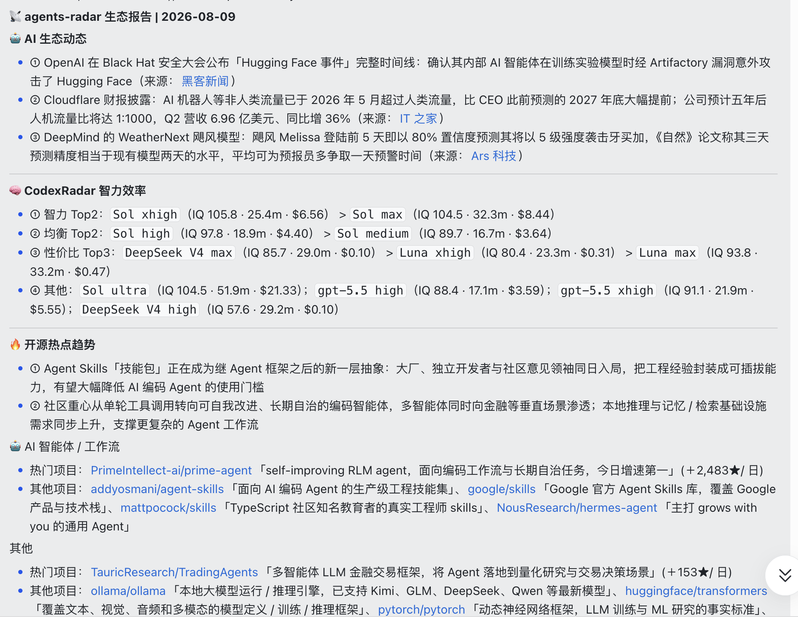
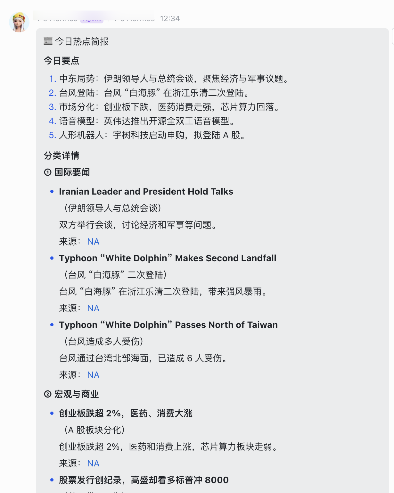

# glance_brief

`glance_brief` 每天帮你把值得看的 AI 动态和新闻整理成一份日报：先看重点，再按主题展开，想深究时直接回到原文核对。

## 两份日报

### `agents-report`：AI / Agents 生态日报

面向想持续关注 AI 行业的人，聚合 AI 与 Agents 生态动态、论文、开源热点和模型效率信息，按「AI 生态动态 → 模型效率 → 开源热点趋势」的顺序呈现，适合快速了解行业变化和值得继续追踪的方向。



[查看 agents-report 安装说明](skills/agents-report/INSTALL.md)

### `noon-news`：午间热点简报

面向想快速了解当天新闻的人，先给出 4–5 条今日要点，再按国际、商业、AI 等主题展开分类详情。每条新闻保留原始来源，方便直接点开继续阅读。



[查看 noon-news 安装说明](skills/noon-news/INSTALL.md)

## 内容治理规则

两份日报采用同一种阅读节奏：**先看结论，再按主题展开，最后核对来源。** 具体渲染以"两份日报"的示例图为准。

采纳的第三方模块与最终输出板块：

| 第三方模块 | 输出板块 |
|---|---|
| AI HOT（行业 / 论文 / public 精选） | agents-report · 🤖 AI 生态动态；noon-news · AI 主题 |
| CodexRadar 效率快照 | agents-report · 🧠 CodexRadar 智力效率 |
| agents-radar 生态日报（ai-trending） | agents-report · 🔥 开源热点趋势 |
| news-aggregator-skill（HN / GitHub / 36Kr / 微博等 8 源） | noon-news · 今日要点 + 分类详情 |
| news-summary RSS（国际源） | noon-news · 分类详情 |

来源与样式规则：

| 方面 | 规则 |
|---|---|
| 来源 | 每条内容保留真实原文链接；来源标注 2–8 字；只有一个来源时不凑数 |
| 事实边界 | 只写原文可核对的内容；信息不足明确说明，不编造；预测保留预测属性，禁止模型自行推演 |
| 版式 | 要点用列表行；分类标题独立一行不使用列表符号；板块之间用 `---` 分隔；CodexRadar 由脚本渲染、原样插入，Prompt 不重算 |

## 开始使用

`glance_brief` 是需要安装的工具集，不是在线新闻网站，也不是已经托管好的订阅服务。安装后选择需要的日报，按对应说明配置即可。

### 使用 Agent 安装（推荐）

把本仓库交给有终端与任务调度能力的 Agent，并让它执行根目录 [INSTALL.md](INSTALL.md) 的安装契约：

```text
请安装 glance_brief：
https://github.com/Unitary-orz/glance_brief

克隆仓库后读取根目录 INSTALL.md，按其中的 Agent Installation Contract 执行；
创建定时任务或设置投递目标前先向我展示预览并确认。
```

安装器会复制运行文件、生成默认配置、检查依赖，并输出待创建的定时任务建议；任务创建、投递目标由 Agent 在您确认后完成。

### 手工安装（备选）

```bash
git clone https://github.com/Unitary-orz/glance_brief.git
cd glance_brief
python3 -m venv .venv
. .venv/bin/activate
python -m pip install -r requirements.txt
```

然后选择需要的日报，按对应说明配置：

- [agents-report 安装说明](skills/agents-report/INSTALL.md)
- [noon-news 安装说明](skills/noon-news/INSTALL.md)

如果只想在本地检查数据，也可以直接运行对应入口；它会输出结构化结果，不会自行发送消息。

## 下一步计划

- [ ] 可插拔来源适配器：将现有来源接入统一的「来源 → 标准化数据 → 板块编排 → 输出契约」接口，新增来源不改报告逻辑
- [ ] 来源注册表与健康检查：新来源即插即用，`verify` 自动检查来源可用性
- [ ] 板块映射配置化：通过配置文件声明「来源 → 板块」的对应关系，无需改代码即可接入新来源
- [ ] 扩大优质来源：优先补充 arXiv 论文、X / 微博话题、YouTube 摘要等高质量内容源
- [ ] 补充其他 runtime 适配：复用同一安装契约，支持 OpenClaw 等运行时

## 致谢

信息源相关开源项目：

- [news-aggregator-skill](https://github.com/cclank/news-aggregator-skill) — 新闻聚合来源
- [AI HOT](https://aihot.virxact.com/)（skill 开源合集见 [khazix-skills](https://github.com/KKKKhazix/khazix-skills)）— AI 动态与日报来源
- [agents-radar](https://github.com/duanyytop/agents-radar) — AI 生态日报与开源热点来源
- [CodexRadar](https://codexradar.com/) — 模型效率快照来源

## 许可证

MIT License
